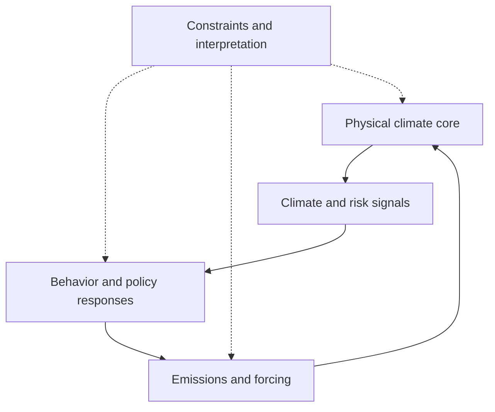

# AI Climate Feedback Review

**Toward an explainable behavior–emission–climate feedback framework**

[Paper / DOI](https://doi.org/10.12006/j.issn.1673-1719.2026.146) · [中文说明](README.zh-CN.md) · [Framework](docs/FRAMEWORK.md) · [Reading guide](docs/READING_GUIDE.md) · [Citation](CITATION.bib)

Companion materials for a review of how artificial intelligence can connect climate physics, human behavior, and evolving emission pathways in long-term climate projections.

## Paper

**AI-driven new-generation climate models: toward an explainable behavior-emission-climate feedback framework**

人工智能驱动的新一代气候模式：走向可解释的行为−排放−气候反馈框架

**Zhao-Ran Feng · Kai-Rui Feng · Yuan Xu · Qing-Chen Chao**

*Climate Change Research* (气候变化研究进展), 2026. **Accepted.** Article language: Chinese.

DOI: [10.12006/j.issn.1673-1719.2026.146](https://doi.org/10.12006/j.issn.1673-1719.2026.146)

## Overview

Long-term climate projections inform energy transitions, infrastructure planning, and climate risk management. Their reliability depends on both the physical climate response and the evolution of emissions. Climate impacts can alter risk perception, policy, investment, and technology adoption, which in turn reshape emissions and future climate conditions.

This review examines how AI can help represent these interactions in a modular, explainable feedback system. It brings together Earth system models, RCP/SSP scenario frameworks, integrated assessment models, human–Earth system coupling, and recent advances in AI weather and climate modeling.

The review develops three connected perspectives:

- **From weather forecasting to climate simulation.** Discuss the additional demands of long integrations, climate statistics, forcing responses, and physical consistency, alongside models such as FourCastNet, GraphCast, Pangu-Weather, NeuralGCM, ACE/ACE2, and DLESyM.
- **From prescribed emissions to behavioral feedback.** Organize climate risk signals, policy and behavioral responses, emissions, and climate dynamics into interpretable modules with explicit interfaces.
- **From a conceptual loop to testable mechanisms.** Examine aerosols and China's clean-air actions as an entry point for historical evaluation, policy-shock analysis, and counterfactual experiments.

## Conceptual framework



The diagram summarizes the conceptual framework discussed in Section 4 of the review. Solid arrows show the feedback loop; dotted arrows show constraints and diagnostic support. It represents a research framework, not an implemented simulation system.

| Module | Scientific role | Methods discussed in the review |
| --- | --- | --- |
| Climate and risk signals | Translate climate states, extremes, and exposure into signals relevant to social responses | Data fusion, representation learning, extreme-event analysis |
| Behavior and policy responses | Describe response strength, delays, regional differences, and adaptation | Causal inference, Bayesian models, sequence models, reinforcement learning |
| Emissions and forcing | Map changes in activity and policy to emissions, concentrations, and radiative forcing | Inventory integration, learned surrogates, physical constraints |
| Physical climate core | Simulate the climate response to changing forcing | Earth system models, simplified climate models, neural operators, hybrid models |
| Constraints and interpretation | Diagnose physical consistency, causal assumptions, and uncertainty | Conservation constraints, counterfactual analysis, uncertainty decomposition |

The framework builds on existing human–Earth system and integrated assessment research. AI contributes tools for heterogeneous data integration, nonlinear response modeling, efficient simulation, and interpretable evaluation.

### Why aerosols?

Aerosols respond rapidly to changes in economic activity and pollution control. Their regional effects, radiative interactions, and cloud interactions provide an observable connection between policy, emissions, air quality, and climate. The review uses China's clean-air actions to discuss how parts of this chain could be evaluated. Greenhouse gases and land-use changes remain essential to long-term projections.

### What should be evaluated?

A credible coupled system requires evidence on climate drift, variability, extremes, and forcing responses; energy, water, and mass consistency; behavioral response direction and delay; and uncertainty from physical models, behavior, policy pathways, and parameter estimation. The [framework notes](docs/FRAMEWORK.md) organize these requirements by module.

## Repository contents

| Resource | Contents |
| --- | --- |
| [中文说明](README.zh-CN.md) | Chinese overview of the paper and repository |
| [Framework notes](docs/FRAMEWORK.md) | Module interfaces, method roles, evaluation principles, and open questions |
| [Reading guide](docs/READING_GUIDE.md) | A thematic route through 12 references cited in the review |
| [CITATION.bib](CITATION.bib) | BibTeX entry for the review article |
| [CITATION.cff](CITATION.cff) | Citation metadata with the article as the preferred citation |

**Availability:** This is a documentation and literature resource for a review article. It contains no executable implementation, trained models, or released datasets. There is no installation step. The manuscript is referenced through its DOI; these companion notes summarize selected ideas and do not replace the article.

## Citation

If the review informs your research, please cite the article:

```bibtex
@article{feng2026aiclimatefeedback,
  author   = {Feng, Zhao-Ran and Feng, Kai-Rui and Xu, Yuan and Chao, Qing-Chen},
  title    = {{AI}-driven new-generation climate models: toward an explainable behavior-emission-climate feedback framework},
  journal  = {Climate Change Research},
  year     = {2026},
  doi      = {10.12006/j.issn.1673-1719.2026.146},
  url      = {https://doi.org/10.12006/j.issn.1673-1719.2026.146},
  language = {Chinese},
  note     = {In Chinese; accepted for publication}
}
```

## Contributions and license

Corrections to references, broken links, and clearly scoped reading suggestions are welcome through GitHub Issues or pull requests. See [CONTRIBUTING.md](CONTRIBUTING.md).

Original companion documentation and the schematic in this repository are licensed under [CC BY 4.0](LICENSE). The journal article and linked third-party works retain their own terms.

Maintained by [Zhaoran Feng](https://github.com/AngelRan-Sii).
